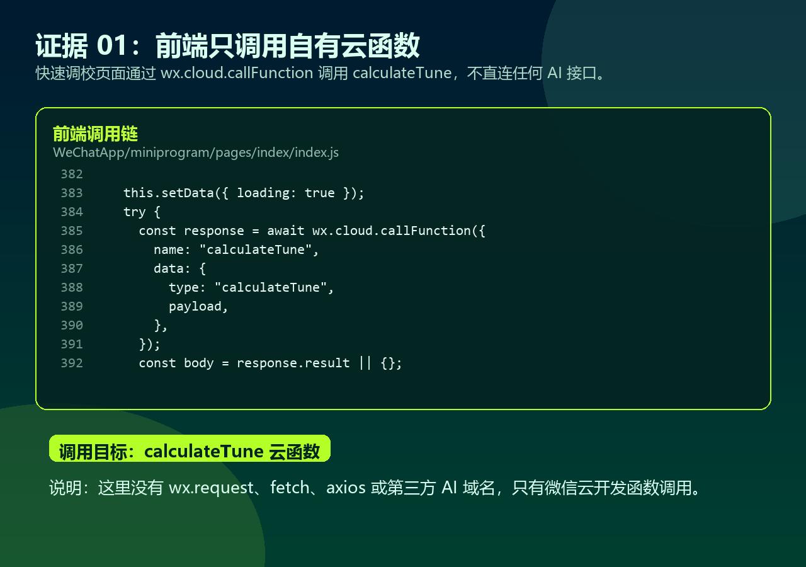
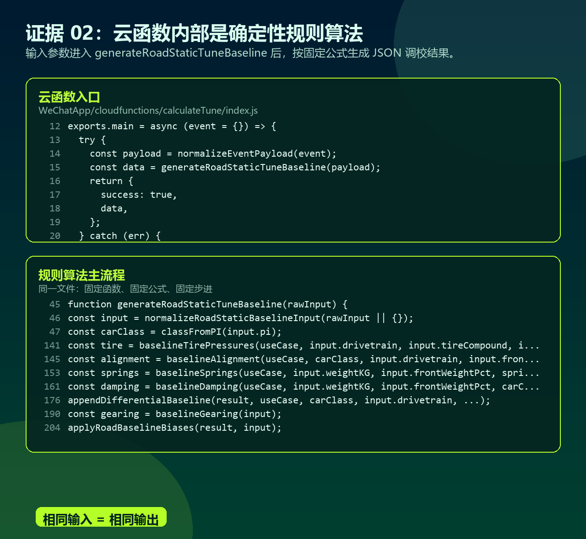
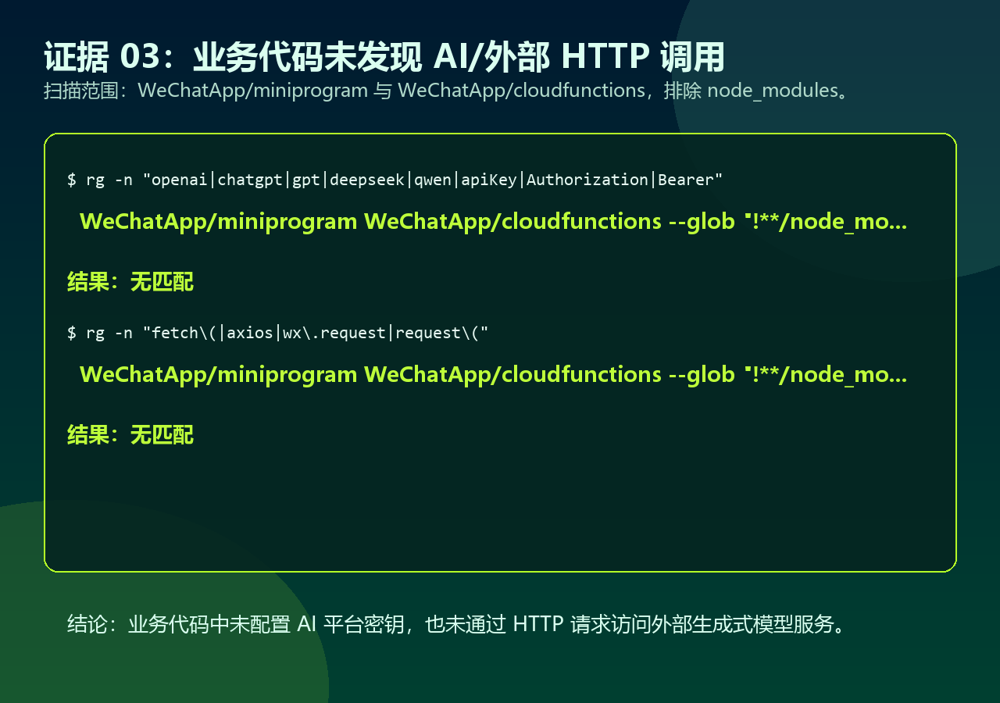
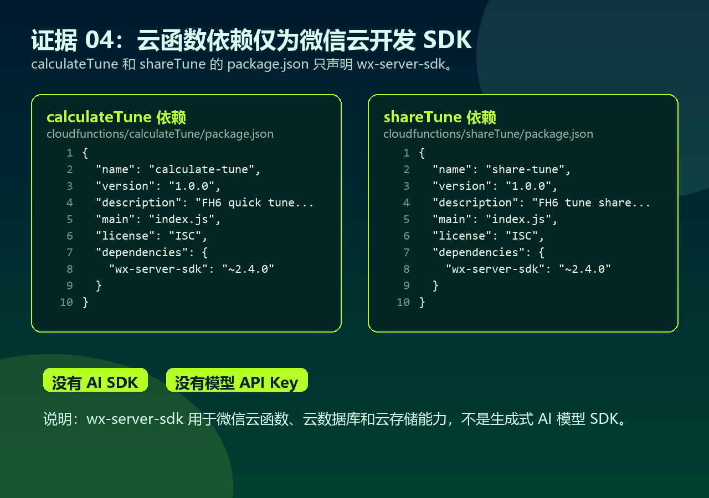

# FH6车辆调校小助手非AI在线生成模型算法说明

## 结论

“FH6车辆调校小助手”的调校生成功能不调用 OpenAI、DeepSeek、通义、文心、智谱、Kimi、豆包等在线生成式 AI 模型，也不通过第三方 HTTP API 请求生成调校结果。

小程序的调校结果来自自有微信云函数 `calculateTune` 中的确定性 JavaScript 规则算法。用户输入车辆用途、PI、驱动形式、轮胎类型、车重、前轴配重、齿轮调校信息和偏好后，云函数按固定公式、固定步进和固定边界计算，返回 JSON 格式调校参数。相同输入会得到相同输出。

## 调用链说明

1. 前端页面只通过 `wx.cloud.callFunction` 调用自有云函数 `calculateTune`。
2. `calculateTune` 云函数调用本地函数 `generateRoadStaticTuneBaseline`。
3. `generateRoadStaticTuneBaseline` 依次计算胎压、轮胎定位、防倾杆、弹簧、阻尼、车高、空气动力学、刹车、差速器和齿轮。
4. 云函数直接返回计算后的 JSON，不向外部 AI 服务发起请求。

## 涉及云能力

- `calculateTune`：用于确定性调校计算，不连接 AI 服务。
- `shareTune`：仅用于用户主动分享时保存 30 天调校快照，不生成内容。
- 云存储：用于车辆推荐 JSON 和车辆图片读取，不生成调校内容。
- 云数据库：用于分享快照读取和写入，不参与 AI 推理。

## 业务代码扫描结果

扫描范围：

```bash
WeChatApp/miniprogram
WeChatApp/cloudfunctions
```

排除范围：

```bash
**/node_modules/**
```

AI/模型/API Key 关键词扫描：

```bash
rg -n "openai|chatgpt|gpt|deepseek|doubao|qwen|tongyi|zhipu|kimi|moonshot|ernie|wenxin|completion|chat/completions|api[_-]?key|Authorization|Bearer" WeChatApp/miniprogram WeChatApp/cloudfunctions --glob "!**/node_modules/**"
```

结果：无匹配。

外部 HTTP 调用扫描：

```bash
rg -n "fetch\(|axios|wx\.request|request\(" WeChatApp/miniprogram WeChatApp/cloudfunctions --glob "!**/node_modules/**"
```

结果：无匹配。

## 依赖说明

两个云函数的 `package.json` 均只声明微信云开发 SDK：

```json
"dependencies": {
  "wx-server-sdk": "~2.4.0"
}
```

`wx-server-sdk` 用于微信云函数、云数据库、云存储等微信云开发能力，不是生成式 AI 模型 SDK。

## 证明截图









