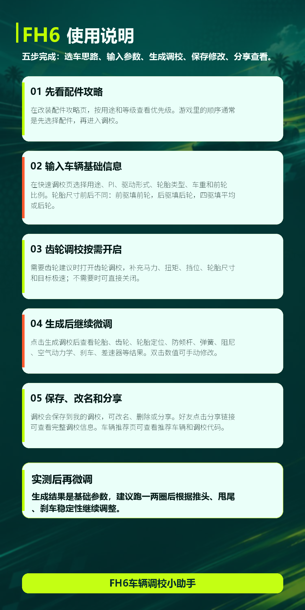

# FH6车辆调校小助手 使用说明

## 适合场景

FH6车辆调校小助手适合想快速得到基础调校参数、再根据赛道表现继续微调的玩家。

## 使用步骤

1. 先看改装配件攻略
   
   在“改装配件攻略”页，按用途和等级查看升级优先级。游戏里的常见顺序是先选择配件，再进入调校。

2. 输入车辆基础信息
   
   在“快速调校”页选择用途、PI、驱动形式、轮胎类型、车重和前轮比例。轮胎尺寸前后不同：前驱填前轮，后驱填后轮，四驱填平均或后轮。

3. 齿轮调校按需开启
   
   需要齿轮建议时打开齿轮调校，补充马力、扭矩、挡位、轮胎尺寸和目标极速；不需要时可以关闭。

4. 生成后继续微调
   
   点击“生成调校”后查看轮胎、齿轮、轮胎定位、防倾杆、弹簧、阻尼、空气动力学、刹车、差速器等结果。双击数值可以手动修改。

5. 保存、改名和分享
   
   调校会保存到“我的调校”，可以改名、删除或分享。好友点击分享链接后，可以查看完整调校信息。

## 使用建议

完美调校不是一次生成出来的。建议先用小助手得到基础参数，再根据赛道表现逐步微调。
